[TOC]

# ZFOS

## 1 关于zfos

​	在嵌入式开发过程中, 有各种各样的板子和外设.   如今单片机功能越来越复杂,有双核的单片机STM32H747, 主频1G的的RT1170, 以及更强大的AM243X 带千兆网卡. 传统的软件开发方式已经跟不上硬件的发展.

​	为什么会出现越来越强大的单片机?因为随着工业的发展, 单片机充当的功能不只是简单的IO控制.  现有10块的全志f1c200s自带64M内存, 为什么我们还选择单片机嘞?  主要的原因就是开发容易, 实时性高.    如果全志f1c200s之类的SOC想要实时系统, 那么就可以考虑xenomai

​	在学习51的时候直接配置寄存器,  学习stm32的时候标准库.  到后来stm32型号多了之后就有了HAL库来统一生态.   经过疫情之后大量的stm32芯片缺货造成了只能用国产芯片.  这个时候如果软件没有做分层.  那么相当于重写一遍代码很浪费时间.   

​	国产芯片riscv的发展很猛, 同时代码也很猛 五花八门的库函数很浪费时间.   有没有一种库能兼容各种单片机嘞?  Open-CMSIS-Pack有可能实现! rt thread驱动如果官方没适配, 自己根本移植不了!    因此诞生了ZFOS解决不同种类的单片机驱动问题


## 2 ZFOS构想

各种单片机共同的都有GPIO,  I2C, SPI,UART这些接口.  只是外设寄存器地址和特殊功能不同而已, 但是都有通用的外设属性. 

比如 stm32和51的串口都是有读数据, 写数据的功能, 但是不同的是两者的外设地址不一样, stm32可能有DMA, 51没dma

因此我们就把串口这个外设给抽取出来, 串口外设最常用的就是设置波特率, 停止位和读写.   但是我们不能再加一层函数去屏蔽差异, 因为这样会降低性能.  最直接的就是用函数指针去调, 类似NXP的ROM API一样, 也像linux一样

**最底层ZF_HAL**

具体如下伪代码:

比如i2c, spi, sdmmc, gpio, qspi 

```c
void uart_config(uint32_t baud)
{
    
}
void uart_write(uint8_t ch, uint8_t *data,uint32_t len)
{
    
}
void uart_read(uint8_t ch, uint8_t *data,uint32_t len)
{
    
}

static struct zfos_uart_t uart = 
{
    .config = uart_config,
    .write = uart_write,
    .read = uart_read
};

void zfos_drv_uart_init(void)
{
    zfos_drv_register(ZF_DRV_TYPE_UART,&uart);
}
```


**驱动管理伪代码:** 

驱动管理负责管理所有的驱动, 放到一个数据里面  当需要某个驱动的时候就从这个数组里面拿取

```

int *zf_driver_list[100];
// 注册驱动
void zfos_drv_register(enum ZF_DRV_TYPE type,void *input_driver)
{
	zf_driver_list[type] =  (int *)input_driver;
}

// 获取驱动
int *zfos_drv_get(enum ZF_DRIVER_TYPE type, void **output_driver)
{
    *output_driver = (void *)zf_driver_list[type];
    return 0;
}
```


**设备层:**

设备层不能调用最底层的代码比如HAL_GPIO_WritePin, 只能调用zfos的驱动 而且为了避免用extern,  全部通过zfos_drv_get来获取驱动

比如KEY按键驱动, 在初始化的时候先获取gpio驱动, 再检查gpio驱动是否存在, 如果不存在就报错 显示目前缺少什么驱动

```c
#include "../zf_driver.h"
#include "../zf_device.h"

#include "zf_dts.h"
#include "key.h"

static struct zf_gpio_t *g_gpio;

uint8_t key_read(uint8_t key)
{
	return g_gpio->read(KEY0_GPIO_Port, KEY0_Pin);
}

int dev_key_init(void)
{	// 获取驱动
	zf_driver_get(ZF_DRIVER_TYPE_GPIO, (void **)&g_gpio);
    // 检查驱动是否存在
	if (check_driver(ZF_DRIVER_TYPE_GPIO,g_gpio))
	{
		return 1;
	}

	key_init();
	return 0;
}

```

```c
#ifndef __ZF_KEY_H__
#define __ZF_KEY_H__

int  dev_key_init(void);
uint8_t key_read(uint8_t key);
#endif
```


这些设备需要一个设备管理器来初始化, 这样方便管理设备

```c
static int (*device_init_groups[])(void) =
    {
        test,
        dev_led_init,
        dev_key_init,
				dev_spi_flash_init,
        dev_qspi_flash_init,
        dev_si2c_init,
        dev_sspi_init,
        dev_touch_init,
        drv_lcd_8080_init,
        dev_oled_init,
        dev_lcd_spi_init,
        dev_lcd_init
		};

int zf_device_init(void)
{
    int i = 0;
		int state = 0;
    // 初始化设备
    for (i = 0; i < sizeof(device_init_groups) / 4; i++)
    {
        state =  (device_init_groups[i])();
				if(state != 0)
				{
					printf("zf_device init error :%d\r\n",i);
				}
    }

    // device task检测
    for(i=0;i<zf_device_task_tASK_MAX_NUM;i++)
    {
        if(zf_device_task_list[i]!=0)
        {
            printf("zf_device task %s init\r\n",zf_device_task_list[i]->name);
        }else{
			 
		}
    }

    return 0;
}

```


## 3  zfos架构

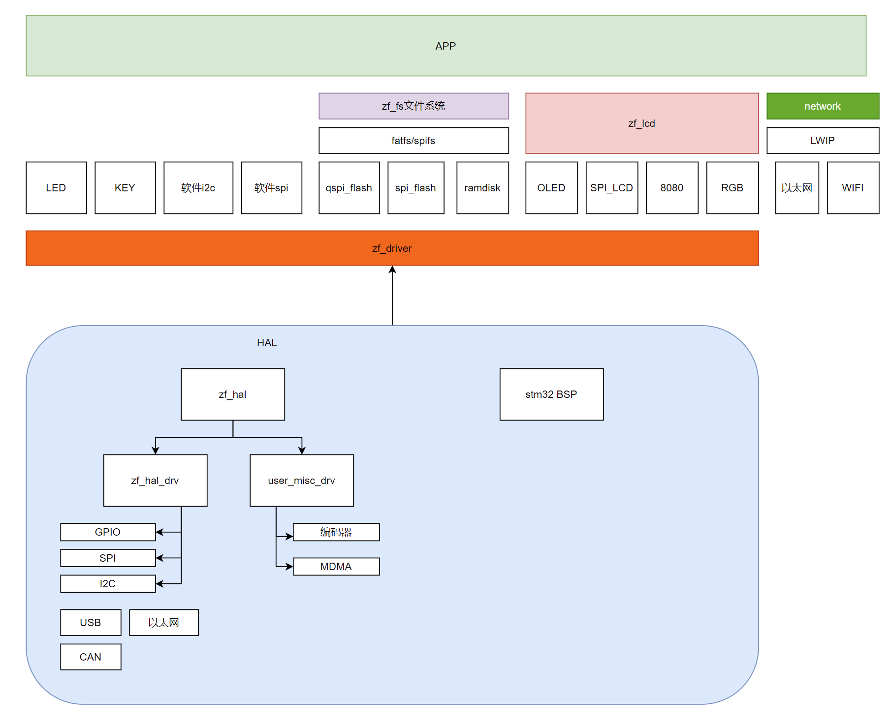

zfos通过zf_driver来屏蔽硬件差异,  同等类型的驱动如spi flash, qspi flash, ramdisk, sdmmc的作用都是储存类的,  提供统一的接口zf_storage, 

再把接口给fatfs文件系统, 最终抽出posix接口的open write read close来读写

oled, spi_lcd, 8080, rgb, mipi等显示设备, 作用都是显示.  提供画点函数和fill函数即可, 统一接口zf_lcd


如果是同一类型的芯片如同stm32系列, 只需要适配一份zf_hal代码就行

### 1  目录结构

整个zfos文件夹如图分为app, board, zfos

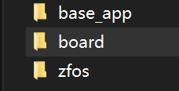

#### 1 board

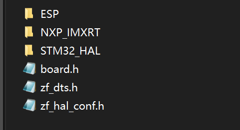

用户需要改动文件夹的内容即可, 不用修改这里的头文件


例如stm32_hal文件夹可以看到有一个zf_hal是用于适配整个stm32的,  其他文件夹分别是不同的stm32板子. 

因为stm32都用的HAL库, 因此zf_hal只有一份

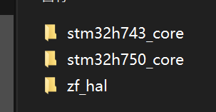

##### 1 stm32h743_core核心板例

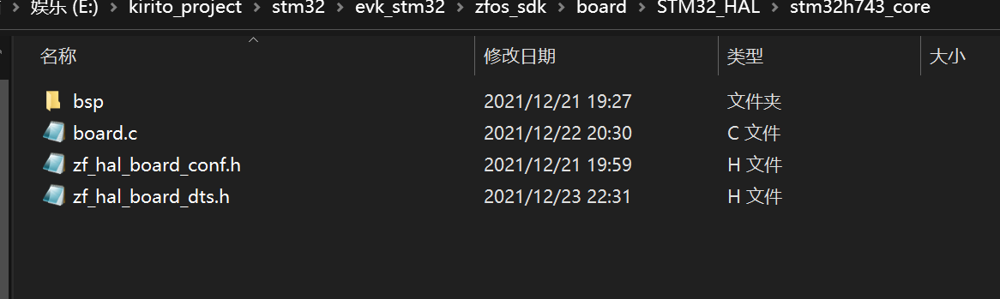

>
>
>bsp为cubemx工程
>
>board.c是板子的初始化, 比如有特殊的外设或者IO口就这里初始化
>
>zf_hal_board_conf.h是 对zf_hal的配置, 比如描述这个板子有几个串口,  有没有LCD_RGB屏幕等
>
>zf_hal_board_dts.h是板子IO口之类的定义,  比如LED是哪个GPIO 这个可以直接复制cubemx生成的main.h里面的


##### 2 zf_hal

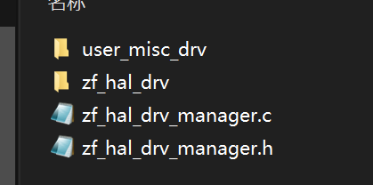

这里是具体的hal实现的代码, 也就是我们需要移植的代码.  

zf_hal_drv是标准的通用驱动

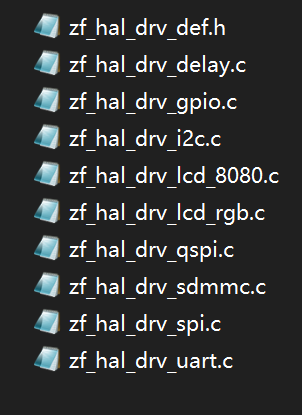

user_misc_drv是非标准的驱动

最终在zf_hal_drv_mananger注册


#### 2 zfos

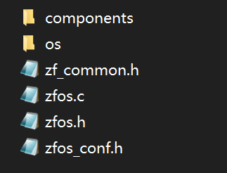

目前就zfos_conf.h是zfos的配置, 包括使用哪些组件 

components是组件, 包括了设备,文件系统, 网络

##### 1 drivers


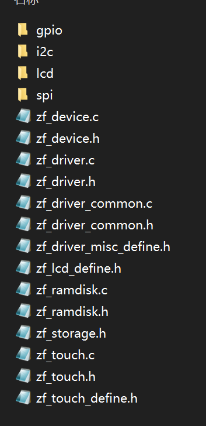

各种设备驱动, 最外层是定义的标准接口,  里面的文件夹是按照类别分的驱动


##### 2 fs文件系统

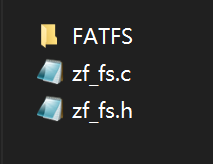

目前提供fatfs的支持, 通过zf_fs.c转换为标准posix接口


### 4 ZF_HAL

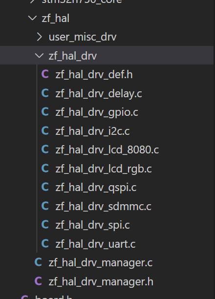

zf_hal的实现是根据zf_driver.h里面的定义来实现的, 比如i2c驱动在zf_driver.h中定义

```c
// i2c
struct zf_i2c_t 
{   
    struct zf_hw_t hw;
    int (*config)(uint8_t ch,uint32_t speed);
    int (*read)(uint8_t ch, uint8_t addr, uint8_t  reg_addr, uint8_t *data,uint16_t len );
    int (*write)(uint8_t ch,uint8_t addr, uint8_t  reg_addr, uint8_t *data,uint16_t len );
};
```

那么在zf_hal_drv里面只需要实现i2c这些接口就行了

```c
/*----------------------------------------------------------------------------------------------------------------
 * Copyright(c)
 * ---------------------------------------------------------------------------------------------------------------
 * File Name : zf_hal_drv_i2c.c
 * Author    : kirito
 * Brief     : 
 * Date      :  2021.12.17
 * ---------------------------------------------------------------------------------------------------------------
 * Modifier                                    Data                                             Brief
 * -------------------------------------------------------------------------------------------------------------*/

#include "zf_hal_drv_def.h"
#if USE_BSP_I2C
#include "i2c.h"
#define I2CX_FLAG_TIMEOUT ((uint32_t)1000)						//0x1100
#define I2CX_LONG_TIMEOUT ((uint32_t)(300 * I2CX_FLAG_TIMEOUT)) //was300

static I2C_HandleTypeDef *g_i2c_handle_group[ZF_I2C_MAX_NUM] =
	{
		&ZF_I2C0,
		&ZF_I2C1,
		&ZF_I2C2};

/**
 * @brief 
 * 
 * @param ch 
 * @return int 
 */
static int i2c_hw_init(uint8_t ch)
{
	return 0;
}

/**
 * @brief 
 * 
 * @param ch 
 * @param cmd 
 * @return int 
 */
static int i2c_hw_get(uint8_t ch, uint8_t cmd)
{
	return 0;
}

/**
 * @brief 
 * 
 * @param ch 
 * @param cmd 
 * @param data 
 * @return int 
 */
static int i2c_hw_set(uint8_t ch, uint8_t cmd, uint32_t data)
{
	return 0;
}

/**
 * @brief 
 * 
 * @param ch 
 * @return int 
 */
static int i2c_hw_close(uint8_t ch)
{
	return 0;
}

/**
 * @brief 
 * 
 * @param channel 
 * @param speed 
 * @return int 
 */
static int i2c_config(uint8_t channel, uint32_t speed)
{
	return 0;
}

/**
 * @brief 
 * 
 * @param ch 
 * @param addr 
 * @param reg_addr 
 * @param len 
 * @param data 
 * @return int 
 */
static int i2c_read(uint8_t ch, uint8_t addr, uint8_t reg_addr, uint8_t *data, uint16_t len)
{

	HAL_StatusTypeDef status = HAL_OK;

	I2C_HandleTypeDef *mh2ic = g_i2c_handle_group[ch];

	status = HAL_I2C_Mem_Read(mh2ic, addr, reg_addr, I2C_MEMADD_SIZE_8BIT, data, len, I2CX_FLAG_TIMEOUT);
	/* 检查通讯状态 */
	if (status != HAL_OK)
	{
		/* 总线出错处理 */
	}
	while (HAL_I2C_GetState(mh2ic) != HAL_I2C_STATE_READY)
	{
	}
	/* 检查SENSOR是否就绪进行下一次读写操作 */
	while (HAL_I2C_IsDeviceReady(mh2ic, addr, I2CX_FLAG_TIMEOUT, I2CX_FLAG_TIMEOUT) == HAL_TIMEOUT)
		;
	/* 等待传输结束 */
	while (HAL_I2C_GetState(mh2ic) != HAL_I2C_STATE_READY)
	{
	}
	return 0;
}

/**
 * @brief 
 * 
 * @param channel 
 * @param addr 
 * @param reg_addr 
 * @param len 
 * @param data 
 * @return int 
 */
static int i2c_write(uint8_t ch, uint8_t addr, uint8_t reg_addr, uint8_t *data, uint16_t len)
{
	HAL_StatusTypeDef status = HAL_OK;
	I2C_HandleTypeDef *mh2ic = g_i2c_handle_group[ch];
	status = HAL_I2C_Mem_Write(mh2ic, addr, reg_addr, I2C_MEMADD_SIZE_8BIT, data, len, I2CX_FLAG_TIMEOUT);
	/* 检查通讯状态 */
	if (status != HAL_OK)
	{
	}
	while (HAL_I2C_GetState(mh2ic) != HAL_I2C_STATE_READY)
	{
	}
	/* 检查SENSOR是否就绪进行下一次读写操作 */
	while (HAL_I2C_IsDeviceReady(mh2ic, addr, I2CX_FLAG_TIMEOUT, I2CX_FLAG_TIMEOUT) == HAL_TIMEOUT)
		;
	/* 等待传输结束 */
	while (HAL_I2C_GetState(mh2ic) != HAL_I2C_STATE_READY)
	{
	}
	return 0;
}

/**
 * @brief 
 * 
 */
static struct zf_i2c_t zf_i2c =
	{
		.hw = {
			.init = i2c_hw_init,
			.get = i2c_hw_get,
			.set = i2c_hw_set,
			.close = i2c_hw_close},

		.config = i2c_config,
		.read = i2c_read,
		.write = i2c_write};

/**
 * @brief 
 * 
 */
void zf_hal_drv_i2c_init(void)
{
	zf_driver_register(ZF_DRIVER_TYPE_I2C, &zf_i2c);
}

#endif

```

每个通道对应的地址&ZF_I2C0在zf_hal_board_conf.h中定义

最终在zf_hal_drv_manager.c中统一注册

```c
static void (*zf_hal_drv_init_groups[])(void) =
    {
        test,
#if USE_BSP_GPIO
        zf_hal_drv_gpio_init,
#endif

#if USE_BSP_DELAY
        zf_hal_drv_delay_init,
#endif
#if USE_BSP_UART
        zf_hal_drv_uart_init,
#endif
#if USE_BSP_I2C
        zf_hal_drv_i2c_init,
#endif
#if USE_BSP_SPI
        zf_hal_drv_spi_init,
#endif
#if USE_BSP_QSPI
        zf_hal_drv_qspi_init,
#endif
#if USE_BSP_SDMMC
        zf_hal_drv_sdmmc_init,
#endif
#if USE_BSP_LCD_RGB
        zf_hal_drv_lcd_rgb_init,
#endif

#if USE_BSP_LCD_8080
    zf_hal_drv_lcd_8080_init
#endif

};

/**
 * @brief 
 * 
 */
void zf_hal_drv_manager_init(void)
{

  int i = 0;
  for (i = 0; i < sizeof(zf_hal_drv_init_groups) / 4; i++)
  {
    (zf_hal_drv_init_groups[i])();
  }
}


```


## 5  设备驱动

### 1 文件系统

目前提供了sdmmc, spi flash ,qspi flash ,ramdisk的支持

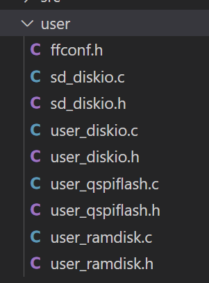

最终在zf_fs.c中注册,  API函数在zf_fs.h中

#### 1 API

```c
int open(const char *pathname, int flags);
int close(int fd);
int read(int fd, void *buf, int count);
int write(int fd, const void *buf, int count);
int lseek(int fd, int offset, int whence);
```


#### 2 demo

```c
#include "zfos.h"

char wr_buf[100];
char rd_buf[100];


uint8_t write_dat[] = "Hello,FATFS!\n";
uint16_t write_num = 0;
unsigned int count = 0;
unsigned char read_buf[50] = {0};
static void fs_test(char *filename_t)
{
  int size = 0;
  int fd = open(filename_t, O_CREAT | O_WRONLY);
  if (fd > 0)
  {
    printf("open %s ok\r\n", filename_t);
    sprintf(wr_buf, "test data:%s write123", filename_t);
    size = write(fd, wr_buf, strlen(wr_buf));
    printf("write %s\r\n", wr_buf);
    close(fd);
  }
  fd = open(filename_t, O_EXCL | O_RDONLY);
	memset(rd_buf,50,0);
  size = read(fd, rd_buf, 50);
  printf("read %d: %s\r\n\r\n", size, rd_buf);
  printf("------------\r\n");
  close(fd);
}

int main()
{
    fs_test("0:test.txt");
	fs_test("1:test.txt");
	fs_test("2:test.txt");
	fs_test("3:test.txt");
    return 0;
}

```


### 2 GPIO

接口zf_driver.h

```c
// gpio
struct zf_gpio_t 
{   
    struct zf_hw_t hw;
    int (*config)(void *pin_port, uint16_t pin, uint16_t io_mode);
    int (*read)(void *pin_port, uint16_t pin);
    int (*write)(void *pin_port, uint16_t pin, uint16_t value);
};

```


#### 1  LED DEMO

```c
#include "../zf_driver.h"
#include "../zf_device.h"

#include "zf_dts.h"
#include "led.h"
static struct zf_gpio_t *g_gpio;
void led_on(void)
{
	g_gpio->write(LED0_GPIO_Port, LED0_Pin, LED_ON);
}

/**
 * @brief 
 * 
 */
void led_off(void)
{
	g_gpio->write(LED0_GPIO_Port, LED0_Pin, LED_OFF);
}

/**
 * @brief 
 * 
 * @param state 
 */
void led_switch(char state)
{
	g_gpio->write(LED0_GPIO_Port, LED0_Pin, state);
}


int dev_led_init(void)
{
	zf_driver_get(ZF_DRIVER_TYPE_GPIO, (void **)&g_gpio);
	if (check_driver(ZF_DRIVER_TYPE_GPIO,g_gpio))
	{
			
		return 1;
	}

	zf_device_register_task(&led);
	return 0;
}


```


#### 2 KEY DEMO

```c
#include "../zf_driver.h"
#include "../zf_device.h"

#include "zf_dts.h"
#include "key.h"

static struct zf_gpio_t *g_gpio;


/**
 * @brief 
 * 
 * @param key 
 * @return uint8_t 
 */
uint8_t key_read(uint8_t key)
{
	return g_gpio->read(KEY0_GPIO_Port, KEY0_Pin);
}

/**
 * @brief 
 * 
 * @return int 
 */
int dev_key_init(void)
{

	zf_driver_get(ZF_DRIVER_TYPE_GPIO, (void **)&g_gpio);
	if (check_driver(ZF_DRIVER_TYPE_GPIO,g_gpio))
	{
		return 1;
	}

	return 0;
}

```

### 3  I2C 

#### 1 自定义时序软件i2c GT911

接口zf_si2c.h

```c
void si2c_init(uint32_t speed);
void si2c_start(void);
void si2c_stop(void);
uint8_t si2c_wait_ack(void);
void si2c_sent_ack(void);
void si2c_sent_nack(void);
void si2c_sent_byte(uint8_t data);
uint8_t si2c_read_byte(uint8_t ack);
```


```c

//向GT9147写入一次数据
//reg:起始寄存器地址
//buf:数据缓缓存区
//len:写数据长度
//返回值:0,成功;1,失败.
static uint8_t GT9147_WR_Reg(uint16_t reg, uint8_t *buf, uint8_t len)
{
    uint8_t i;
    uint8_t ret = 0;
    si2c_start();
    si2c_sent_byte(GT_CMD_WR); //发送写命令
    si2c_wait_ack();
    si2c_sent_byte(reg >> 8); //发送高8位地址
    si2c_wait_ack();
    si2c_sent_byte(reg & 0XFF); //发送低8位地址
    si2c_wait_ack();
    for (i = 0; i < len; i++)
    {
        si2c_sent_byte(buf[i]); //发数据
        ret = si2c_wait_ack();
        if (ret)
            break;
    }
    si2c_stop(); //产生一个停止条件
    return ret;
}

//从GT9147读出一次数据
//reg:起始寄存器地址
//buf:数据缓缓存区
//len:读数据长度
static void GT9147_RD_Reg(uint16_t reg, uint8_t *buf, uint8_t len)
{
    uint8_t i;
    si2c_start();
    si2c_sent_byte(GT_CMD_WR); //发送写命令
    si2c_wait_ack();
    si2c_sent_byte(reg >> 8); //发送高8位地址
    si2c_wait_ack();
    si2c_sent_byte(reg & 0XFF); //发送低8位地址
    si2c_wait_ack();
    si2c_start();
    si2c_sent_byte(GT_CMD_RD); //发送读命令
    si2c_wait_ack();
    for (i = 0; i < len; i++)
    {
        buf[i] = si2c_read_byte(i == (len - 1) ? 0 : 1); //发数据
    }
    si2c_stop(); //产生一个停止条件
}


```


#### 2  软件I2c OLED驱动DEMO

接口:zf_si2c.h

```c

// 模仿硬件i2c
void si2c_init(uint32_t speed);
int si2c_write(uint8_t ch,uint8_t addr, uint8_t  reg_addr, uint8_t *data,uint16_t len );
```


代码太长放伪代码

```c
void oled_write_gram(int i)
{
	si2c_write(0, 0x78, 0x40, mtemp, 128);
}

//发送一个字节
// mode:数据/命令标志 0,表示命令;1,表示数据;
void oled_write_byte(uint8_t dat, uint8_t mode)
{
	si2c_write(0, 0x78, 0x00, &dat, 1);
}
```

#### 3 硬件i2c

接口: zf_driver.h

```c
struct zf_i2c_t 
{   
    struct zf_hw_t hw;
    int (*config)(uint8_t ch,uint32_t speed);
    int (*read)(uint8_t ch, uint8_t addr, uint8_t  reg_addr, uint8_t *data,uint16_t len );
    int (*write)(uint8_t ch,uint8_t addr, uint8_t  reg_addr, uint8_t *data,uint16_t len );
};
```


```c
#include "../zf_driver.h"
#include "../zf_device.h"
#include "zf_dts.h"
#include "zf_si2c.h"

#include "oled.h"

static struct zf_i2c_t *g_i2c;

void oled_write_gram(int i)
{
	g_i2c->write(0, 0x78, 0x40, &dat, 1);
}

//发送一个字节
// mode:数据/命令标志 0,表示命令;1,表示数据;
void oled_write_byte(uint8_t dat, uint8_t mode)
{
	g_i2c->write(0, 0x78, 0x40, &dat, 1);
}


int dev_oled_init(void)
{

	zf_driver_get(ZF_DRIVER_TYPE_I2C, (void **)&g_i2c);
	if (check_driver(ZF_DRIVER_TYPE_I2C, g_i2c))
	{
		return 1;
	}
}
```


### 4 SPI 

#### 1 软件spi 

1 接口

```
void sspi_init(uint32_t speed);
void sspi_write(uint8_t dat);
```

#### 2 硬件spi 

接口

```c
struct  zf_spi_t 
{   
    struct zf_hw_t hw;
    int (*config)(uint8_t ch,uint32_t speed);
    int (*read)(uint8_t ch,uint8_t *data,uint16_t len);
    int (*write)(uint8_t ch,uint8_t *data,uint16_t len);
    int (*write_read)(uint8_t ch, uint8_t *send_data, uint16_t send_len, uint8_t *read_data, uint16_t read_len);
};
```

#### 3 LCD_SPI DEMO


```c
static struct zf_spi_t *g_spi;
static struct zf_gpio_t *g_gpio;

void lcd_spi_write_reg(uint8_t dat)
{
	g_spi->write(1, &dat, 1);
}

void lcd_round_spi_addr_set(uint16_t x1, uint16_t y1, uint16_t x2, uint16_t y2)
{
	lcd_spi_write_reg(0x2a); //列地址设置
	lcd_spi_write_data(x1);
	lcd_spi_write_data(x2);
	lcd_spi_write_reg(0x2b); //行地址设置
	lcd_spi_write_data(y1);
	lcd_spi_write_data(y2);
	lcd_spi_write_reg(0x2c); //储存器写
}

int dev_lcd_spi_init(void)
{

	zf_driver_get(ZF_DRIVER_TYPE_GPIO, (void **)&g_gpio);
	zf_driver_get(ZF_DRIVER_TYPE_SPI, (void **)&g_spi);
	if (check_driver(ZF_DRIVER_TYPE_GPIO, g_gpio))
	{
		return 1;
	}
	else
	{

		if (check_driver(ZF_DRIVER_TYPE_SPI, g_spi))
		{
			return 1;
		}
	}
}
```


### 5 QSPI

接口

```c
struct zf_qspi_t 
{   
    struct zf_hw_t hw;
    int (*config)(uint8_t ch,uint32_t speed);
    int (*read)(uint8_t ch,uint8_t *data,uint32_t len);
    int (*write)(uint8_t ch,uint8_t *data,uint32_t len);
    int (*write_cmd)(uint8_t ch,uint32_t instruction, uint32_t address, uint32_t dummyCycles, uint32_t instructionMode, uint32_t addressMode, uint32_t addressSize, uint32_t dataMode);
};
```

#### 1 qspi_flash DEMO


```c
#include "../zf_driver.h"
#include "../zf_device.h"

#include "qspi_flash.h"

static struct zf_gpio_t *g_gpio;
static struct zf_qspi_t *g_qspi;

static void qspi_flash_qspi_enable(void)
{
    uint8_t stareg2;
    stareg2 = qspi_flash_read_sr(2); //先读出状态寄存器2的原始值
    if ((stareg2 & 0X02) == 0)       //QE位未使能
    {
        qspi_flash_write_enable();       //写使能
        stareg2 |= 1 << 1;               //使能QE位
        qspi_flash_write_sr(2, stareg2); //写状态寄存器2
    }
    g_qspi->write_cmd(QSPI_FLASH_CH,W25X_EnterQPIMode, 0, 0, QSPI_INS_1_LINE, QSPI_ADDR_NONE, QSPI_ADDR_8_BITS, QSPI_DATA_SIZE_NONE); //写command指令,地址为0,无数据_8位地址_无地址_单线传输指令,无空周期,0个字节数据
    QSPI_FLASH_QPI_MODE = 1;                                                                                              //标记QSPI模式
}

int dev_qspi_flash_init(void)
{
	zf_driver_get(ZF_DRIVER_TYPE_GPIO, (void **)&g_gpio);
	zf_driver_get(ZF_DRIVER_TYPE_QSPI, (void **)&g_qspi);
	if (check_driver(ZF_DRIVER_TYPE_GPIO,g_gpio))
	{
				return 1;
	}else {
		
		if (check_driver(ZF_DRIVER_TYPE_QSPI,g_qspi))
		{
					return 1;
		}
	}
	
	if (qspi_flash_init() == 0)
	{
		return 0;
	}
	 return 0;
}

```

### 6 sdmmc

接口

```c
struct zf_sdmmc_t 
{   
    struct zf_hw_t hw;
    int (*config)(uint8_t ch,uint32_t speed);
    int (*get_info)(uint8_t ch,uint8_t *card_type, uint16_t *block_size, uint32_t *bloack_num, unsigned long long *size);
    int (*erase_all)(uint8_t ch);
    int (*erase_range)(uint8_t ch,uint32_t addr, uint32_t size);
    int (*read)(uint8_t ch,uint32_t addr, uint8_t *buff, uint32_t size);
    int (*write)(uint8_t ch,uint32_t addr, uint8_t *buff, uint32_t size);
};
```

#### 1 FATFS DEMO

```c

#include "../zf_driver.h"

#define SDMMC_CH 0
static struct zf_sdmmc_t *g_sdmmc;

#include "../src/ff_gen_drv.h"
#include "sd_diskio.h"

const Diskio_drvTypeDef  SD_Driver =
{
  SD_initialize,
  SD_status,
  SD_read,
#if  _USE_WRITE == 1
  SD_write,
#endif /* _USE_WRITE == 1 */

#if  _USE_IOCTL == 1
  SD_ioctl,
#endif /* _USE_IOCTL == 1 */
};

DSTATUS SD_initialize(BYTE lun)
{
	zf_driver_get(ZF_DRIVER_TYPE_SDMMC, (void **)&g_sdmmc);
	if (g_sdmmc == 0)
	{
		printf("get sdmmc drv error\r\n");
	}
	
  Stat = STA_NOINIT;
  Stat &= ~STA_NOINIT;

  return Stat;
}

DSTATUS SD_status(BYTE lun)
{

  Stat = STA_NOINIT;
  Stat &= ~STA_NOINIT;
  return Stat;
}

DRESULT SD_read(BYTE lun, BYTE *buff, DWORD sector, UINT count)
{
  g_sdmmc->read(SDMMC_CH,sector,buff,count);
 return RES_OK;
}

DRESULT SD_write(BYTE lun, const BYTE *buff, DWORD sector, UINT count)
{
  g_sdmmc->write(SDMMC_CH,sector,(uint8_t*)buff,count);
 return RES_OK;
}

DRESULT SD_ioctl(BYTE lun, BYTE cmd, void *buff)
{
  DRESULT res = RES_ERROR;

  if (Stat & STA_NOINIT) return RES_NOTRDY;

	uint8_t card_type;
	uint16_t block_size;
	uint32_t bloack_num;
	unsigned long long size;
	g_sdmmc->get_info(SDMMC_CH,&card_type,&block_size,&bloack_num,&size);

  switch (cmd)
  {
  /* Make sure that no pending write process */
  case CTRL_SYNC :
    res = RES_OK;
    break;

  /* Get number of sectors on the disk (DWORD) */
  case GET_SECTOR_COUNT :

    *(DWORD*)buff = bloack_num;
    res = RES_OK;
    break;

  /* Get R/W sector size (WORD) */
  case GET_SECTOR_SIZE :

    *(WORD*)buff = block_size;
    res = RES_OK;
    break;

  /* Get erase block size in unit of sector (DWORD) */
  case GET_BLOCK_SIZE :
    *(DWORD*)buff =block_size / SD_DEFAULT_BLOCK_SIZE;
    res = RES_OK;
    break;

  default:
    res = RES_PARERR;
  }

  return res;
}

```

### 7 LCD

接口

```c
// lcd type
struct zf_lcd_t 
{   
    struct zf_hw_t hw;
    int (*config)(uint8_t ch,void *config);
	int (*draw_point)(uint8_t ch,uint16_t x, uint16_t y, uint32_t color);
    
	int (*fill)(uint8_t ch,uint16_t sx, uint16_t sy, uint16_t ex, uint16_t ey, uint32_t color);
	int (*color_fill)(uint8_t ch,uint16_t sx, uint16_t sy, uint16_t ex, uint16_t ey, uint16_t *color);
    int (*flush)(uint8_t ch);
};
```

所有的屏幕都是RGB屏幕为基准的, 

因此实现都在zf_lcd.c里面, 对屏幕的配置在lcd_configl.c里面

#### 1 LCD_SPI屏幕

只需要实现上述的接口就行, 然后注册到驱动管理器

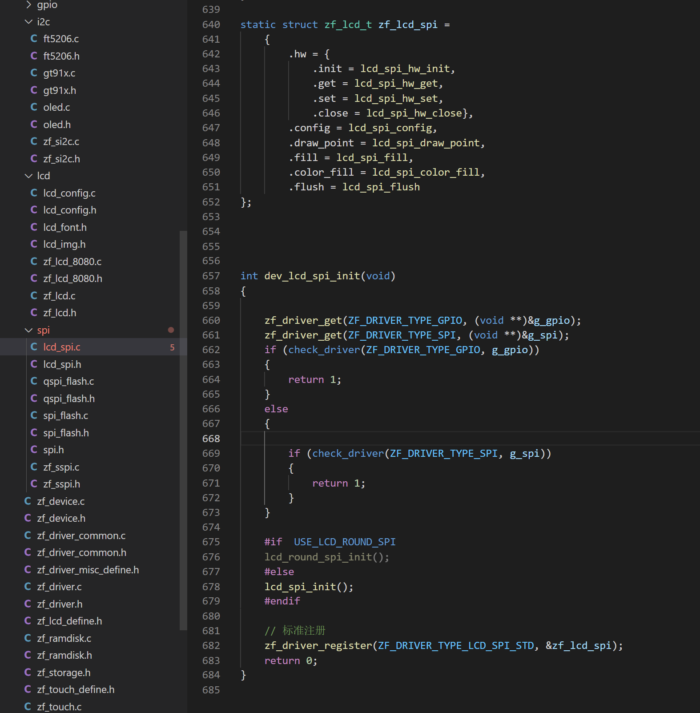

 

调用: 

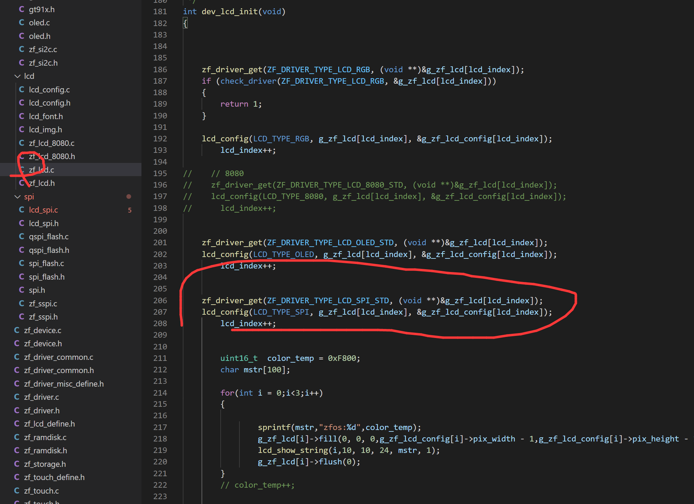


在zf_lcd.c中找到初始化, 从驱动管理器获取LCD_SPI的驱动, 然后调用lcd_config配置, 最终用调用数组g_zf_lcd就可以了


配置: 

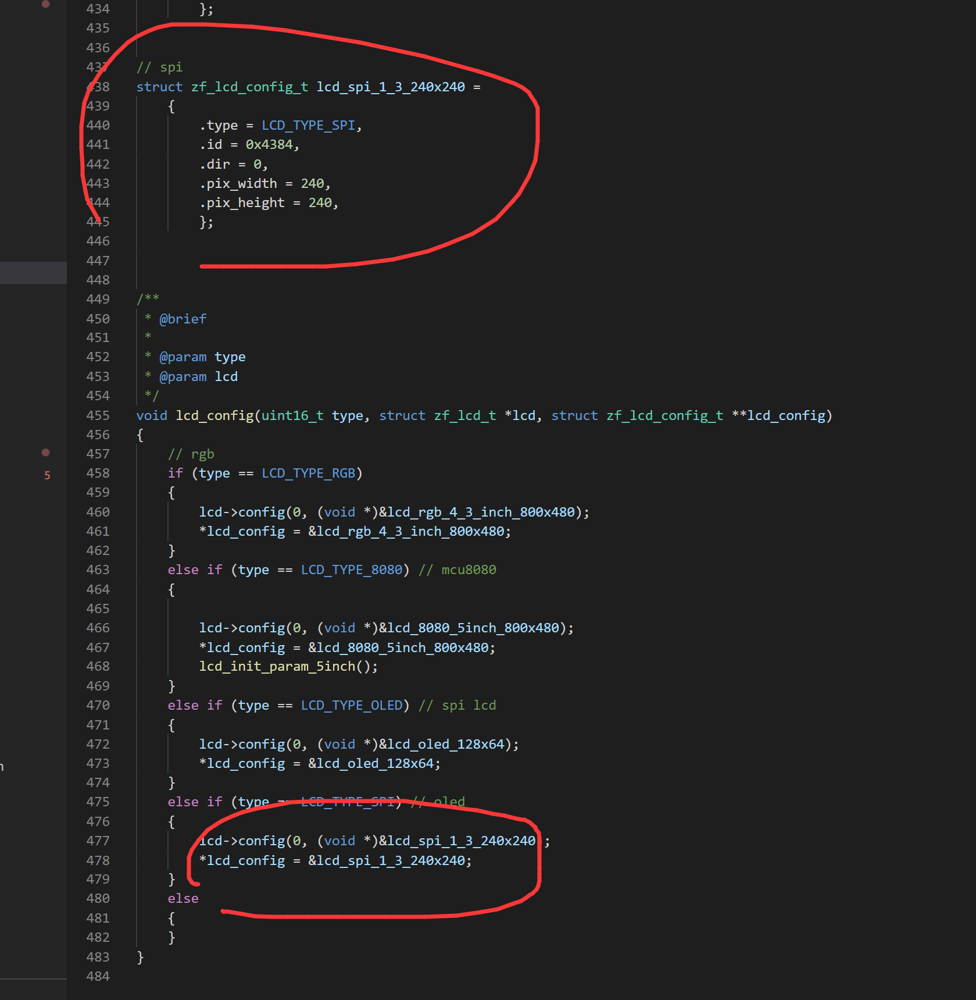

在lcd_config.c中写结构体, 然后 下面配置


#### 2 LCD_RGB屏幕

使用方法和上面差不多, 这里主要讲配置

在lcd_config.c中添加lcd的配置, 然后下面初始化就行了,  以后添加rgb屏幕只需要配置时序就OK

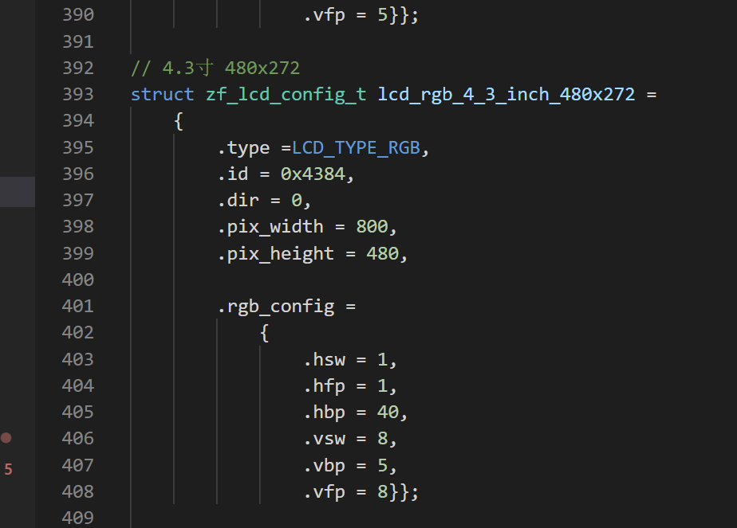

#### 3 LCD_8080屏幕

已经写好了8080的驱动, 用户只需要关注配置就行 在lcd_config.c中

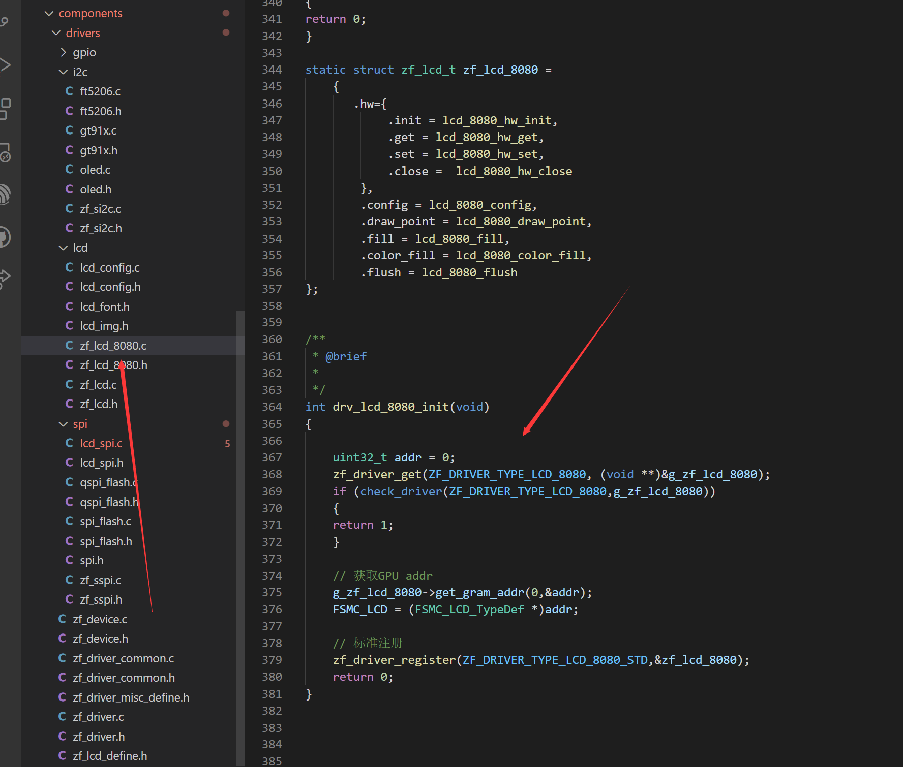

添加屏幕长宽, 和刷屏指令

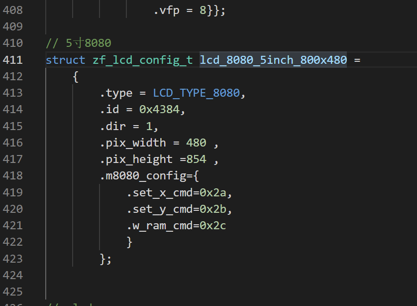

#### 4 OLED

目前适配了0.96寸和1.3寸IIC的驱动, 用户只需要关系用0.9寸还是1.3寸

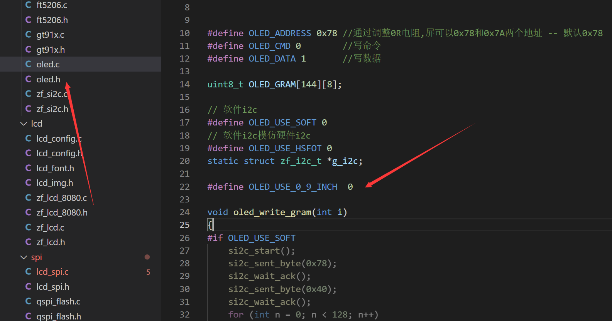
